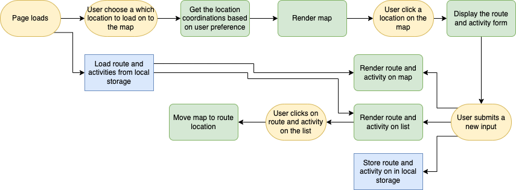

# 🦮 Pupwalk: Dog Walk Tracker

A web application for dog owners where they can log their pet's activities while they're on a walk. They can track the route their dog takes, their activities, and how long they stayed at certain locations. The user can have an option to use a map for either the Richmond Park or their current location.

## Tech Stack

`HTML 5`, `SASS`, `JavaScript`, `Leaflet API`, `Geolocation API`, `localStorage API`, and `Git`

⚡️ This project was mainly built with `ES6 Classes` and `Vanilla JavaScript (VanillaJS)`. `SweetAlert` was integrated for alert popup messages pretty.

## Features

- A map where user clicks to add a new route/activity.
- Form to input the dog's time-in, time-out, activities, and any owner's notes. Timespent and Log Date is automatically computed.
- Display all activities in a list and on a map.
- Storing route/activity data in browser using local storage API

## App Screens


## Flowchart



## Lessons Learned

This was the first project where I use `ES6 Classes` to structure my code. It does make the project architecure much cleaner and I was able to separate the application logic and the data.


I also learned easy it was to get the current user location and integrate it to a map. In this few lines of code using `Geolocation API`, we can already get the user's current location.

```code
 navigator.geolocation.getCurrentPosition(success_function,error_function)
```

The `success_function` is where we can access the user's current location and use their coordinates to integrate to any map API.

> 💡 In this application, I used the code above for the user's to get their current coordinates, and integrate LeafletAPI. Meanwhile for a specific location such as the Richmond Park, I hardcoded its coordinates to the API.

_Problem with switching locations_
_using localstorageAPI_

## Run Locally

Install dependencies (this will install `sass` and `live-server`)

```bash
  npm install
```

Start the server

```bash
  npm run start
```

## License

> Read license [here](LICENSE.txt)
