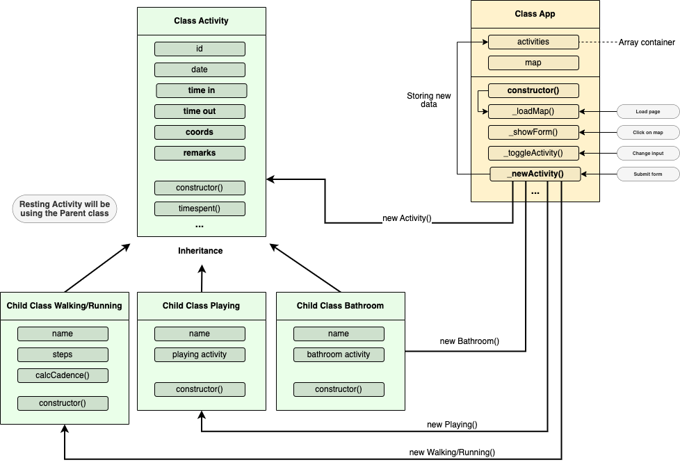

## Lessons Learned

This was the first project where I use `ES6 Classes` to structure my code. It does make the project architecure much cleaner and I was able to separate the application logic and the data.


I also learned easy it was to get the current user location and integrate it to a map. In this few lines of code using `Geolocation API`, we can already get the user's current location.

```code
 navigator.geolocation.getCurrentPosition(success_function,error_function)
```

The `success_function` is where we can access the user's current location and use their coordinates to integrate to any map API.

> 💡 In this application, I used the code above for the user's to get their current coordinates, and integrate LeafletAPI. Meanwhile for a specific location such as the Richmond Park, I hardcoded its coordinates to the API.

_Problem with switching locations_
_using localstorageAPI_

## Lessons Learned

This was the first project where I use `ES6 Classes` to structure my code. It does make the project architecure much cleaner and I was able to separate the application logic and the data.


I also learned easy it was to get the current user location and integrate it to a map. In this few lines of code using `Geolocation API`, we can already get the user's current location.

```code
 navigator.geolocation.getCurrentPosition(success_function,error_function)
```

The `success_function` is where we can access the user's current location and use their coordinates to integrate to any map API.

> 💡 In this application, I used the code above for the user's to get their current coordinates, and integrate LeafletAPI. Meanwhile for a specific location such as the Richmond Park, I hardcoded its coordinates to the API.

_Problem with switching locations_
_using localstorageAPI_
